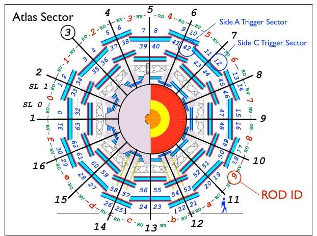
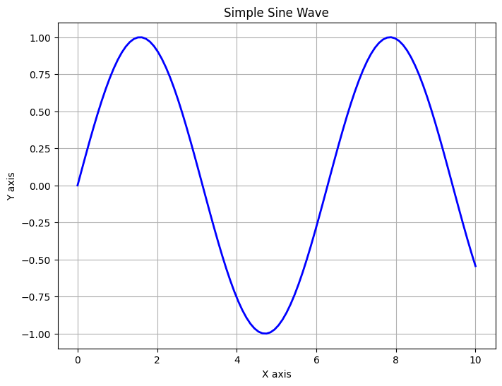

<mdpyexL0U5611056375 block="true" />

```python
class myclass:
    def __init__(self):
        self.my_val = "hello world from my class123"

    def do_something(self):
        return "something else very much else"
my = myclass()


```
<mdpyexL0U5611056375 end="true"/>


<mdpyexL0U1380879503 disp="my.do_something()" />
something else very much else
<mdpyexL0U1380879503 end="true"/>

asdadwqeadsasdasdasd


[123AgainAgain](#program.example2())dfsdfsd

[](#test)

# test

adsad
sad


